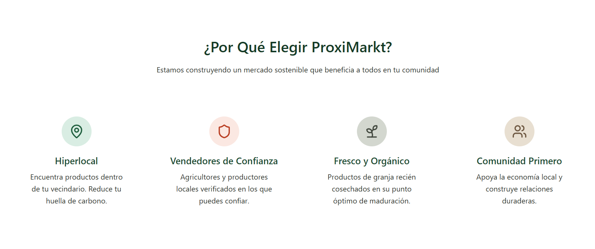
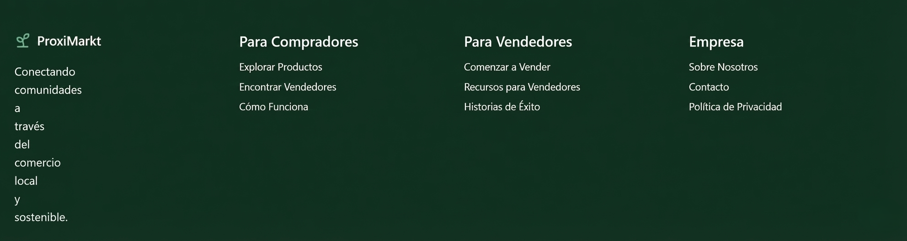
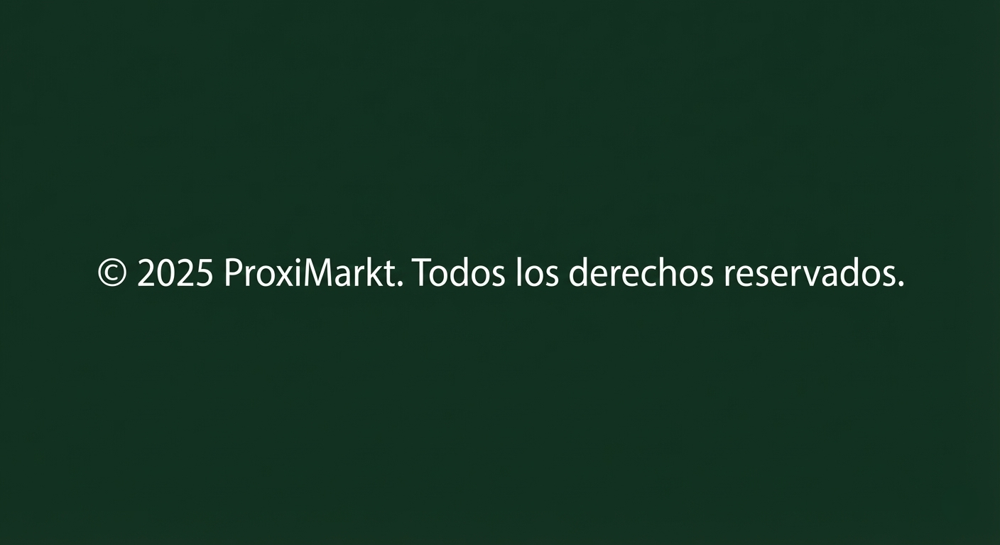
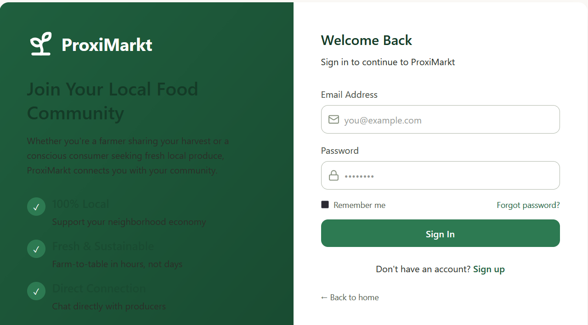
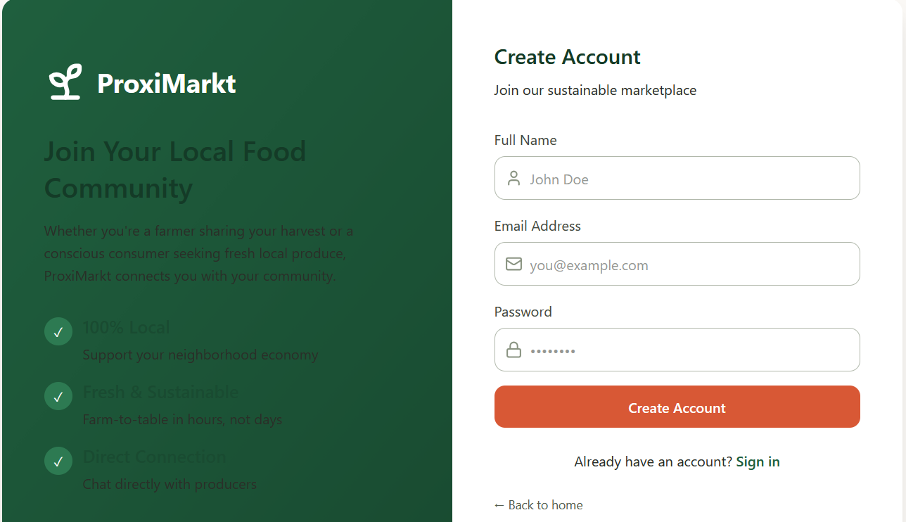

# Prototip
## Index
- [Prototip](#prototip)
    + [Index](#index)
    + [Tecnologies utilitzades per al prototip](#tecnologies-utilitzades-per-al-prototip)
        * [Figma](#figma)
    + [Resum](#resum)
        * [Pantalla principal](#pantalla-principal)
        * [Pantalla de login](#pantalla-de-login)
        * [Pantalla d'usuaris](#pantalla-dusuaris)
    
## Tecnologies utilitzades per al prototip
### Figma

    
 

<em>Fig 1: Logo de Figma</em>
 
Figma, desenvolupat per Dylan Field i Evan Wallace començaren a treballar en Figma en 2012 i el van llançar el 27 de setembre de 2016 és un editor de gràfics vectorial i una ferramenta de generació de prototips, principalment basada en la web, amb característiques “off-line” addicionals habilitades per aplicacions d’escriptori en macOS i Windows.

Hem utilitzat Figma únicament per a fer el prototip de l'aplicació. Ens va servir per a planificar el disseny visual abans de començar a programar l’aplicació, i assegurar-mon que l’estructura i els estils quedaren clars.

## Resum
Este document es tracta de documentar sobre el prototip de l'aplicació de `ProxiMarkt`, la qual consta dels següents apartats:
- Pantalla principal
- Pantalla de login
- Pantalla d'usuaris

### Pantalla Principal
La pantalla principal té com a objectiu introduir a l'aplicació, proporcionar informació de la empresa i dur cap a la pantalla de login, en ella pot veure informació sobre `ProxiMarkt` i que és, consta d'una capçalera per a introduir l'aplicació:

    

<em>Fig 2: Capçalera de la pantalla principal</em>
 

El cos de l'aplicació, que conté informació sobre `ProxiMarkt`:

    

<em>Fig 3: Primera secció de la pantalla principal</em>
 

    

<em>Fig 4: Segunda secció de la pantalla principal</em>
 

    

<em>Fig 5: Tercera secció de la pantalla principal</em>
 

I per últim el peu de pàgina que conté informació per a la companyia i informació útil per als usuaris sobre com funciona l'aplicació.

    

<em>Fig 6: Peu de pàgina de la pantalla principal</em>
 

### Pantalla de login

La pàgina de login és una pantalla en la qual l'usuari es pot registrar o iniciar sessió, per a iniciar sessió conté 2 camps:
- Correu electònic
- Contrasenya

    

<em>Fig 7: Pantalla de login</em>
 

I si li apretes al boto de `Registrar-se` s'obrirà una nova finestra en la qual s'afegira un nou camp:
- Nom complet
- Correu electònic
- Contrasenya 

    

<em>Fig 8: Pantalla de registre</em>
 

I quan et registres tornara a la pàgina de login i quan inicies sessió arribaràs a la següent i última pàgina, la pantalla d'usuaris.

### Pantalla d'usuaris

Per últim, en la pantalla d'usuaris ja siga com a venedor com a comprador podran mirar/comprar productes tant posar-los a la venta, també tens l'opció de filtrar els productes per:
- Preu
- Quantitat
- Categoria
- Distància màxima

Al apretar-li a `Afegir producte` s'obrira una finestra en un formulari que conté els següents camps:
- Nom del producte
- Preu
- Descripció
- Imatge del producte
- Categoria
- Quantitat
- Localització per a la venda

## Conclusió
Com bé diu el seu nom, el prototip no serà la versió final de l'aplicació, però representa com es podria vore en un futur i/o ajudar en el desenvolupament de les vistes en aquest.