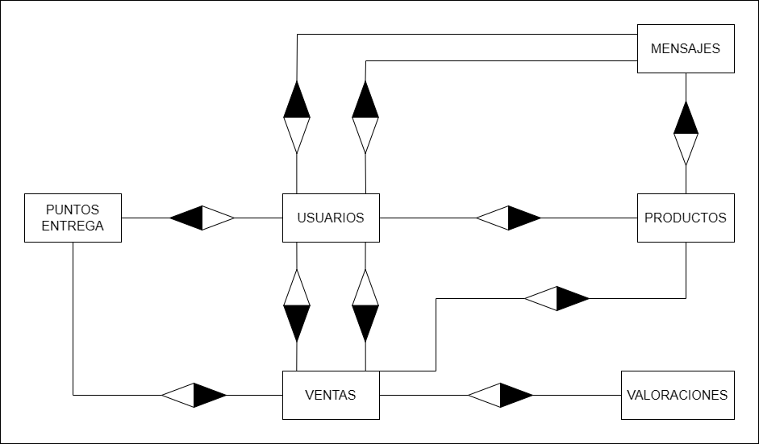

**TABLE USERS**
- id_user INT PK
- name VARCHAR(255)
- email VARCHAR(255)
- password VARCHAR(255)
- phone CHAR(12)
- registration_date TIMESTAMP

**TABLE PRODUCTS**
- id_product INT PK
- id_user INT FK
- name VARCHAR(255)
- description TEXT
- price DOUBLE
- stock DOUBLE
- image
- type_stock ENUM (Kg, unidad)
- state ENUM (Agotado, Reservado, Disponible)
- publication_date TIMESTAMP

**TABLE MESSAGES**
- id_message INT PK
- id_product INT FK
- id_transmitter INT FK
- id_receiver INT FK
- content TEXT
- shipping_date TIMESTAMP

**TABLE SALES**
- id_sale INT PK
- id_product INT FK
- id_buyer INT FK
- id_seller INT FK
- id_delivery_point INT FK
- id_review INT FK
- sale_date DATE
- total double
- collection_date DATE
- state ENUM(Pendiente, En Curso, Terminado)

**TABLE DELIVERY POINT**
- id_delivery_point INT PK
- id_user INT FK
- name VARCHAR(255)
- direction VARCHAR(255)
- latitude DOUBLE
- length DOUBLE

**TABLE REVIEWS**
- id_review INT PK
- id_sale INT FK
- calification ENUM(1,2,3,4,5)
- comment TEXT
- review_date DATE

**TABLE CATEGORIES**
- id_categorie INT PK
- id_product INT FK
- name VARCHAR(255)

**RELACIONES**

**USERS <--> MESSAGES**
Tenim 2 relacions d'un a molts, ja que en un missatge ha d'haver-hi 2 usuaris per a poder rebre i enviar missatges, i un usuari pot enviar molts missatges però solo els rebrà una persona.

**USERS <--> PRODUCTS**
Tenim una relació d'un a molts, ja que un usuari pot tindre molts productes i un producte només el pot pujar un usuari.

**USERS <--> SALES**
Tenim 2 relacions d'un a molts, ja que un venedor i un comprador poden estar en diverses vendes, però en una venda només pot haver-hi un venedor i un comprador.

**USERS <--> DELIVERY POINT**
Tenim una relació d'un a molts, ja que un usuari pot tindre molts punts de lliurament però un punt de lliurament només pot tindre un usuari (hem pensat que el punt de lliurament és el camp propi del venedor i no un punt en comú entre els dos).

**MESSAGES <--> PRODUCTS**
Tenim una relació d'un a molts, ja que d'un producte pot haver-hi molts xats amb diferents compradors, però en un xat només pot haver-hi un producte.

**PRODUCTS <--> SALES**
Tenim una relació d'un a un, ja que en una venda només s'embene un producte.

**SALES <--> DELIVERY POINT**
Tenim una relació d'un a molts, ja que en un punt de lliurament es poden fer diverses vendes, però una venda només es pot fer en un punt de lliurament.

**SALES <--> REVIEWS**
Tenim una relació d'un a molts, ja que una venda pot tindre diverses valoracions, però una valoració no pot estar en diverses vendes (pot haver-hi diverses vendes amb cinc estreles, però eixa valoració a un usuari no serà la mateixa que en una altra venda).

**PRODUCTS <--> CATEGORIES**
Tenim una relació d'un a molts, ja que una categoría pot tindre diversos productes associats, pero un producte sols pot estar dins d'una categoría.
