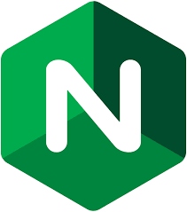
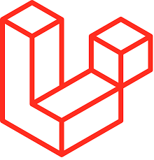
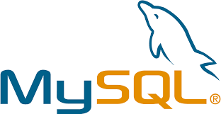
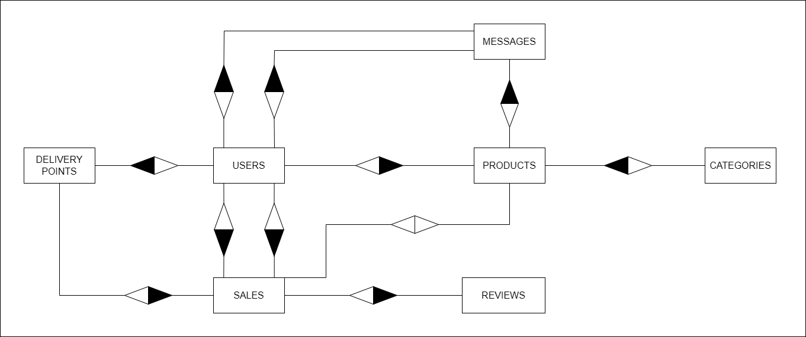

# Memòria del projecte
## Index
- [Memòria del projecte](#memòria-del-projecte)
    + [Index](#index)
    + [Introducció](#introducció)
    + [Tecnologies](#tecnologies-implementades)
        * [Figma](#figma)
        * [Nginx](#nginx)
        * [Laravel](#laravel)
        * [MySQL](#mysql)
        * [Vue](#vue)
    + [Prototip](#prototip)
    + [Diagrames](#diagrames)
        * [E/R](#er)
        * [Casos d'ús](#casos-dús)
    + [Analisis de les possibles solucions](#analisis-de-les-possibles-solucions)
        * [Node vs Laravel](#node-vs-laravel)
            - [Avantatges](#avantatges)
            - [Desavantatges](#desavantatges)
        * [Vue vs HTML+CSS+JS](#vue-vs-htmlcssjavascript)
            - [Avantatges](#avantatges-1)
            - [Desavantatges](#desavantatges-1)
        * [Opinió del grup](#opinió-del-grup)
    + [Arquitectura del sistema](#arquitectura-del-sistema)
        * [MySQL -> Backend](#mysql---backend)
            - [Autenticació en tokens i middleware](#autenticació-en-tokens-i-middleware)
                + [Instal·lació de Sanctum](#installació-de-sanctum)
                    * [Implementació](#implementació)
                        - [Models](#models)
                        - [Controladors i peticions](#controladors-i-peticions)
                        - [Creació del token en el controlador](#creació-del-token-en-el-controlador)
                        - [Creació de les rutes i els middlewares necessaris](#creació-de-les-rutes-i-els-middlewares-necessaris)
        * [Backend -> Frontend](#backend---frontend)
    + [Desenvolupament de la solució](#desenvolupament-de-la-solució)
        * [Consideracions prèvies](#consideracions-prèvies)
        * [Configuració del projecte i posada en marxa](#configuració-del-projecte-i-posada-en-marxa)
            - [Configuració del projecte i posada en marxa (Local(Development))](#configuració-del-projecte-i-posada-en-marxa-localdevelopment)
            - [Configuració del projecte i posada en marxa (Local(Production))](#configuració-del-projecte-i-posada-en-marxa-localproduction)
    + [Funcionament de l'aplicació](#funcionament-de-laplicació)
    + [Dificultats i futures millores](#dificultats-i-futures-millores)
    + [Desplegament de l'aplicació](#desplegament-de-laplicació)
        * [Aplicació usada per al desplegament](#aplicació-usada-per-al-desplegament)
        * [Explicació del desplegament en Azure](#explicació-del-desplegament-en-azure)
    + [Dificultats](#dificultats)
    + [Futures millores](#futures-millores)
    + [Conclusió](#conclusió)
    + [Bibliografia](#bibliografia)

## Introducció
Actualment les persones preferixen comprar articles en linea, cosa que és molt comoda, però sempre està el pensament de `qui és qui em ven el producte?`, i tampoc pots comentar del estat que té el producte fins que t'arribe a casa, això és el que consegueix la nostra aplicació.

ProxiMarkt és una aplicació web en la qual permet la compra/venda de productes mitjançant un xat integrat, l'objectiu és facilitar la venda dels productes dels venedors i la compra per part dels usuaris interessats en els productes de forma local, la qual podrà connectar productors i comerços locals amb els seus clients, afavorint el comerç de proximitat.

## Tecnologies utilitzades
### Figma
<p align= "center">
    
 </p>
<p align="center"><em>Fig 1: Logo de Figma</em></p>

Figma, desenvolupat per Dylan Field i Evan Wallace començaren a treballar en Figma en 2012 i el van llançar el 27 de setembre de 2016 és un editor de gràfics vectorial i una ferramenta de generació de prototips, principalment basada en la web, amb característiques “off-line” addicionals habilitades per aplicacions d’escriptori en macOS i Windows.

Hem utilitzat Figma únicament per a fer el prototip de l'aplicació. Ens va servir per a planificar el disseny visual abans de començar a programar l’aplicació, i assegurar-mon que l’estructura i els estils quedaren clars.

### Nginx
<p align= "center">
    
 </p>
<p align="center"><em>Fig 2: Logo de Nginx</em></p>


Hem usat Nginx com al nostre servidor web que permet la visualització de l'aplicació web en un navegador web

### Laravel
<p align= "center">
    
 </p>
<p align="center"><em>Fig 3: Logo de Laravel</em></p>

Hem usat Laravel per al desenvolupament backend de l'aplicació, mitjançant l'arquitectura MVC, usant APIs, middlewares..., etc.

### MySQL
<p align= "center">
    
 </p>
<p align="center"><em>Fig 4: Logo de MySQL</em></p>

Hem utilitzat MySQL com a la nostra base de dades per a emmagatzemar els usuaris, productes, xat..., etc.

### Vue
<p align= "center">
    
 </p>
<p align="center"><em>Fig 5: Logo de Vue</em></p>

Hem utilitzat Vue per al frontend de l'aplicació, més específicament per ser un framework de JavaScript modern molt utilitzat e implementar l'estructura de HTML, els estils de CSS i les funcions de JavaScript.
## Prototip
Abans de posar-se a programar s'ha de saber com volem que siga l'estructura i aparença de l'aplicació i també per a fer-se una idea del que s'ha de fer per la part visual (client) i així sabent el que li podria interessar al client o no en empreses reals. 
Per la part del programador el prototip pot ser una guia de com s'ha de veure l'aplicació, però no necessàriament ha de ser `EXACTAMENT` igual al que està en el prototip, al final es podran afegir/eliminar coses per raons molt diverses: funcionalitat, estètica..., etc. 
Però al final el propòsit del prototip va ser el comentat abans: guiar als programadors de com s'ha de veure l'aplicació de forma aproximada i en projectes reals mostrar com seria l'aparença de l'aplicació a l'usuari. 
Perquè ens hem basat en el prototip, excepte sols en alguns canvis que van sorgir en el desenvolupament, si voleu veure la documentació completa del prototip, podeu anar a la rama `Documentacion` amb el següent comand:
```bash
git checkout Documentacion
```
I busques la carpeta `Documentació Prototip` o obri el següent enllaç que et dura directament a la documentació del prototip:
[https://github.com/sergi1307/ProyectoIntermodular/blob/Documentacion/Documentació Prototip/Documentació Prototip.md](https://github.com/sergi1307/ProyectoIntermodular/blob/Documentacion/Documentaci%C3%B3%20Prototip/Documentaci%C3%B3%20Prototip.md)

## Diagrames
### E/R
Primerament per a parlar dels diagrames hem de parlar de l'esquema E/R, un dels primers diagrames que s'ha de fer abans de la realització del projecte, la qual definira les relacions que tindran les taules de la BD entre si i fonamental per a fer-se una idea del que s'ha d'afegir a la BD i que no. 
I igual que el prototip no necessàriament s'ha de centrar `EXACTAMENT` al E/R, pots afegir/eliminar coses mentre l'aplicació vaja creixent i conveniència mentre es desenvolupa el projecte. 

<p align= "center">
    
 </p>
<p align="center"><em>Fig 6: Esquema E/R</em></p>

Si voleu consultar la documentació completa de la E/R, es troba a la branca `Documentacion` del repositori.

I busques la carpeta `Documentació BD` o obri el següent enllaç que et dura directament a la documentació del esquema E/R:
[https://github.com/sergi1307/ProyectoIntermodular/blob/Documentacion/Documentació BD/entitatRelacio.md](https://github.com/sergi1307/ProyectoIntermodular/blob/Documentacion/Documentaci%C3%B3n%20BD/entitatRelacio.md)

### Casos d'ús
Seguidament, anem a parlar dels casos d'ús, també un dels primers diagrames que s'ha de realitzar abans de la realització del projecte, el qual servira per a saber les classes que podria tindre cada objecte del programa i quina funcionalitat podria tindre.
I igual que en el prototip no ha de ser `EXACTAMENT` igual als casos d'ús final, sempre es pot afegir/eliminar coses en el desenvolupament del projecte.

<p align= "center">
    
 </p>
<p align="center"><em>Fig 7: Diagrama de casos d'ús</em></p>

Si voleu consultar la documentació completa, es troba a la branca `Documentacion` del repositori.

I busques la carpeta `Documentació Casos d'ús` o obri el següent enllaç que et dura directament a la documentació del esquema de casos d'ús:
[https://github.com/sergi1307/ProyectoIntermodular/blob/Documentacion/Documentació de Casos d'ús/Casos d'ús.md](https://github.com/sergi1307/ProyectoIntermodular/blob/Documentacion/Documentaci%C3%B3%20Casos%20d'ús/Casos%20d'ús.md)

## Analisis de les possibles solucions
En este apartat analitzarem les tecnologies en les quals este projecte pot ser desenvolupat i el perquè hem seleccionat unes i altres no, les tecnologies seran les que es van donar en el curs de 2n DAW presencial en els mòduls de DWEC (Desenvolupament en entorn client) i DWES (Desenvolupament en entorn servidor), les tecnologies en les quals es va a desenvolupar són:
- Backend:
    - NodeJS(Express)
    - PHP(Laravel)
- Frontend:
    - Vue(JavaScript)
    - HTML+CSS+JS
### Node vs Laravel
Primerament compararem les millors formes de desenvolupar el backend:
- NodeJS (JavaScript)
- Laravel (PHP)
#### Avantatges
| Avantatges NodeJS              | Avantatges Laravel                                                      |
|:-------------------------------|:------------------------------------------------------------------------|
| Eficiència i escalabilitat     | Facilitat d'ús                                                          |
| JavaScript Full Stack          | Bona documentació                                                       |
| Ecosistema enorme amb `npm`    | Escalabilitat                                                           |
| Comunitat molt activa i suport | Eines modernes (API REST, desenvolupament frontend integrat, seguretat) |

#### Desavantatges

| Desavantatges NodeJS                     | Desavantatges Laravel          |
|:-----------------------------------------|:-------------------------------|
| No ideal per a tasques CPU intensives    | Més complex al principi        |
| Maduresa d'algunes llibreries            | Major consum de recursos       |
| Corba d'aprenentatge per a l'asincronia  | Dependència externa            |

### Vue vs HTML+CSS+JavaScript
Seguidament comparararem les formes en les quals podem desenvolupar el frontend:
- HTML+CSS+JS
- Vue
#### Avantatges
| Avantatges HTML+CSS+JS         | Avantatges Vue                 |
|:-------------------------------|:-------------------------------|
| Molt simple                    | Components                     |
| Control total del DOM          | Reactivitat automàtica         |
| Sense dependències             | Escalabilitat                  |
| Molt lleuger                   | Eines modernes (CLI, Devtools) |

#### Desavantatges

| Desavantatges HTML+CSS+JS      | Desavantatges Vue              |
|:-------------------------------|:-------------------------------|
| Difícil d'escalar              | Més complex al principi        |
| Actualització manual del DOM   | Major consum de recursos       |
| Arquitectura a càrrec del dev  | Corba d'aprenentatge més alta  |

### Opinió del grup
En el nostre grup hem decidit usar Laravel per al backend Vue per al frontend, la pregunta és:

Per què?

- `Vue`: Evitar recarregues completes de les pàgines millorant l'experiència de l'usuari gracues al SPA (`S`ingle `P`age `A`pplication)

- `Laravel`: ORM per a evitar la inserció manual de codi SQL, capacitat de crear migracions per a molts entorns Backend i accés a middlewares que faciliten la seguretat de les peticions.

A més Laravel facilita molts aspectes que en Node deuries de dedicar més temps, per exemple:

- Laravel:
    - Generació automàtica dels directoris de MVC, encara que sense contingut funcional
    - Generació de BD completes sols amb 1 comand si les migracions estan completes
    - Implementació automàtica d'una carpeta de bootstrap
    - Projectes Full Stack més facils sense necessitat d'altres llenguatges de programació
- Node:
    - Sense MVC de forma automàtica
    - Creació de la BD a mà o amb un script
    - No té carpeta de bootstrap directa
    - Projectes Full Stack un poc més complicats degut a que tens que familiaritzar-te amb HTML

I al igual que Laravel, Vue facilita moltes més coses que usar HTML+CSS+JS directament:
- Vue:
    - Actualització automàtica sols al guardar canvis en els fitxers.
    - Fitxers més comprimits amb més funcionalitats sense necessitat de crear molts més fitxers.
    - Capacitat de crear components per a reutilitzar funcionalitats sense necessitat de copiar codi, a més d'aplicar estils.
    - Té capacitat per a executar la aplicació en `development` i en `production`.
- HTML+CSS+JS:
    - Actualització manual en la web (F5 o Ctrl+R).
    - Molts fitxers que cadascú crida a un altre fitxer.
    - També capacitat de crear components, però més complicat.
    - `No` té capacitat per a executar la aplicació en `development` i en `production`, sols la executa tal i com està si no és manipula.
## Arquitectura del sistema
Com bé hem dit en anterioritat en este projecte hem usat Laravel per al backend i Vue per al frontend, la qual segueix una arquitectura client-servidor basada en un SPA (Single Page Application) en el frontend i una API REST en el backend. Aquesta separeació permet escalar independentment cada capa i facilita el manteniment i evolució del sistema.

Abans d'explicar com funciona l'aplicació, primerament hem d'explicar com es connecta Vue a Laravel i com aprofita eixa informació, comencem per parts:

### MySQL -> Backend
Primerament anem a dir com es connecta el backend de Laravel a la BD de MySQL en el contenidor de Docker:

En el `docker-compose.yml` que està en la carpeta de `Backend` del projecte es creen les dades necessaries per a crear la base de dades i un usuari, junt a la contrasenya per a accedir a ella i el volum que montara l'aplicació i on podrem accedir a ella al executar el contenidor i el port per defecte de MySQL, el 3306.
[!IMPORTANT] 
Les dades que n'hi han en el docker-compose son inventades, en una documentació np s'ha de posar dades de la BD, sols les pose per a que es vega com està configurat i facilitar el configurament de forma local
```yml
 mysql:
    image: mysql:8
    environment:
      MYSQL_ROOT_PASSWORD: P@$$
      MYSQL_USER: user
      MYSQL_PASSWORD: user
      MYSQL_DATABASE: DB
    volumes:
      - DB:/var/lib/mysql
    ports:
      - "3306:3306"
```

En el contenidor de docker de PHP es posen les dades que havíem introduït en el contenidor de la BD, per a connectar-mo'n a la BD, i és requerira el contenidor de mysql per a que funcione.
```yml
php:
    build: ./php
    user: 1000:1000
    volumes:
      - ./src:/var/www/html
      - ./php/conf.d/99-xdebug.ini:/usr/local/etc/php/conf.d/99-xdebug.ini
    environment:
      MYSQL_HOST: mysql
      MYSQL_USER: user
      MYSQL_PASSWORD: user
      MYSQL_DB: DB
    depends_on:
      - mysql
```
Sols seria fer:
```bash
docker compose up -d --build
```
I ja estaria la BD, sols queda explicar com conecta el backend a la BD, això de forma local, en el desplegament sols és connecten el App Service(Laravel) i la Azure Database(MySQL), però això ja s'explicara més endavant.

Ara en Laravel per a pasar dels endpoints a les consultes de MySQL, és fara de la següent forma:

Petició API -> Controlador -> Model -> Migració -> BD
[!important]
Esta és una versió simplificada sols per a mostrar com va el flux i explicar com funciona tot el recorregut.

Primerament, començarem amb la petició API cridant a l'endpoint corresponent, amb l'exemple dels productes la qual està definida en `routes/api.php`:
```php
Route::get('/productes', [ProductController::class, 'index'])->name('index');
```
Al fer l'endpoint `http://localhost:8080/api/productes` anirà al controlador de productes `ProductController` i buscara la funció `index` i l'executara.
```php
public function index()
    {
        // Ací obtenim tots els productes del model i de la migració de la BD
        $products = Product::all();

        // Ací tornem les dades en forma de JSON
        return response()->json($products);
    }
```
Ara bé, en el controlador hem cridat al model, però exactament que fa el model?

El model rebrà les dades de la BD en forma d'objecte per a poder utilitzar les variables per a assignar o donar valors per a rebre la informació, veiem ara un exemple del model de productes:
```php
class Product extends Model
{
    // Taula a la que es comunicara en la BD
    protected $table = 'products';

    // Definimos la primary key
    protected $primaryKey = 'id_product';

    // Definimos els camps de la BD que es poden emplenar
    protected $fillable = [
        'id_user',
        'id_delivery_point',
        'id_category',
        'name',
        'description',
        'price',
        'stock',
        'image',
        'type_stock',
        'state',
        'publication_date'
    ];

    // Definim els camps que l'usuari no pot plenar.
    protected $hidden = [
        'id_user',
        'id_delivery_point',
        'id_category',
    ];

    // Funció per a obtindre les vendes de la relació 1 -> 1
    public function sale()
    {
        return $this->hasOne(Sale::class, 'id_product', 'id_product');
    }

    // Funció per a obtindre els missatges de la relació 1 -> M
    public function messages()
    {
        return $this->hasMany(Message::class, 'id_product');
    }
}
```
Per últim les migracions son les taules i les columnes que tindra la BD, que al executar el comand:
```bash
php artisan migrate
```
Muntara tot el que n'hi ha en el la funció `up` en una taula de la BD, i és borrara en el `down` al executar el  següent comand:
```bash
php artisan migrate:reset
```
Veiem un exemple dels productes:

```php
return new class extends Migration
{
    /**
     * Run the migrations
     * Executar la migració
     */
    public function up(): void
{
    Schema::create('products', function (Blueprint $table) {
        // Id autoincrementable
        $table->increments('id_product');
        // Altres ids
        $table->unsignedInteger('id_user');
        $table->unsignedInteger('id_delivery_point');
        $table->unsignedInteger('id_category');
        // Columna de VARCHAR
        $table->string('name', 255);
        // Columna de TEXT
        $table->text('description');
        // Columnes de FLOAT
        $table->float('price');
        $table->float('stock');
        // Columna de ENUM
        $table->enum('state', ['Agotado', 'Reservado', 'Disponible']);

        // Claus foranies
        $table->foreign('id_user')->references('id_user')->on('users')->onDelete('cascade');
        $table->foreign('id_delivery_point')->references('id_delivery_point')->on('delivery_points')->onDelete('cascade');
        $table->foreign('id_category')->references('id_category')->on('categories')->onDelete('cascade');
    });
}

    /**
     * Reverse the migrations
     * Elimina la migració
     */
    public function down(): void
    {
        Schema::dropIfExists('products');
    }
};
``` 
#### Autenticació en tokens i middleware
Abans d'explicar la connexió en el front ens agradaria parlar sobre com funcionen els tokens en el nostre projecte i com els hem usat en Laravel, en este cas hem usat el paquet de Laravel `Sanctum`:

I que és Sanctum?

`Sanctum` és un paquet dins de `Laravel` que permet la creació de `tokens` de forma senzilla basades en `APIs`, el qual permet generar múltiples tokens API, estos tokens poden tindre diverses funcions/àmbits els quals poden permetre a l'hora d'executar-se.
##### Instal·lació de Sanctum
Primerament, necessitem instal·lar el gestor de APIs de Laravel, si estàs en la versió 12 o superior, si no pots botar-te este pas:
```bash
php artisan install:api
```
Per a importar el paquet `Sanctum`, necessitem executar els següents comands:
```bash
composer require laravel/sanctum
```
Este comand crea el paquet de `Sanctum`:
```bash
php artisan vendor:publish --provider="Laravel\Sanctum\SanctumServiceProvider"
```
I per últim alcem les migracions de `Sanctum`:
```bash
php artisan migrate
```
##### Implementació
###### Models
Ja quan tingueu `Sanctum` correctament instal·lat i configurat ja podem usar-lo per a posar-li els tokens a l'usuari, però primer hem de modificar el model dels usuaris abans de fer els controladors de la següent forma:

```php
// Importem la llibreria de Sanctum de "HasApiTokens"
use Laravel\Sanctum\HasApiTokens;

// Implementem Authenticaable per a que puga autenticar i protrgir les rutes.
/*
IMPORTANT
Authenticable hereta de Model, així que ja té totes les funcions de "Eloquent/Model"
*/
class User extends Authenticatable
{
    use HasApiTokens, HasFactory, Notifiable;
}
```
[!IMPORTANT] 
Authenticable hereta de Model, així que ja té totes les funcions de `Eloquent/Model`

###### Controladors i peticions
Ara suposem que ja tenim un controlador i peticions en el qual pugues:
- Crear usuaris (Register)
```php
    // Request/Petició
    // Exten de FormRequest
    class UserRequest extends FormRequest
    {
        /**
         * Defineix els camps a omplir en el formulari:
         * nom: String obligatori màxim 255 caracters
         * email: String obligatori màxim 255 caracters que no es pot tornar a repetir
         * password: String obligatori
         */
        public function rules()
        {
            return [
                'name' => 'required|string|max:255',
                'email' => 'required|string|email|max:255|unique:users',
                'password' => 'required|string'
            ];
        }
    }
```
```php
    // Controlador
    /**
    * Crea un usuari mitjançant:
    *  - nom
    *  - correu electrònic
    *  - contrassenya
    */
    public function createUser(UserRequest $request)
    {
        // Passa el nom, correu i contrassenya per a crear-lo
        $user = User::create([
                'name' => $request->name,
                'email' => $request->email,
                'password' => Hash::make($request->password),
             ]);
        // Resposta en forma de JSON
        return response()->json([
            'status' => 'true',
            'message' => 'Usuari creat correctament'
        ], 200);
    }
```
- Autenticar usuaris (Login)
```php
    // Request/Petició
    class LoginUserRequest extends FormRequest
    {
        /**
         * Defineix els camps a omplir per al formulari
         * email: String obligatori màxim 255 caracters
         * password: String obligatori
         */
        public function rules()
        {
            return [
                'email' => 'required|string|email|max:255',
                'password' => 'required|string'
            ];
        }
    }
```
```php
    // Controlador
    public function loginUser(LoginUserRequest $request)
    {
        // Condicional d'error si l'usuari s'enganya al posar les credencials
        if (!Auth::attempt($request->only(['email', 'password']))) {
            // Resposta en JSON
            return response()->json([
                'status' => 'false',
                'message' => 'Credencials incorrectes',
            ], 401);
        }
        // Verifica el usuari
        $user = User::where('email', $request->email)->first();
        // Resposta en JSON
        return response()->json([
            'status' => 'true',
            'message' => 'Usuari autenticat correctament',
        ], 200);
    }
```
###### Creació del token en el controlador
Per a proporcionar-li el token a l'usuari, hem de ficar una línia extra en la resposta, la qual s'anomena `token`, que es creara de la següent forma:
```php
// 'token': Etiqueta JSON que creara el token
// createToken('api-token')->plaintext: Funció que creara el token en forma de "text pla"
return response()->json([
    'token' => $user->createToken('api-token')->plaintext
], 200)
```

I perquè estiguen en les funcions anteriors de `Register` i `Login` sols hem d'afegir la línia anterior al codi abans esmentat en la resposta del JSON:
```php
return response()->json([
    'status' => 'true',
    'message' => 'Usuari creat correctament',
    'token' => $user->createToken('api-token')->plaintext
], 200);
```
###### Creació de les rutes i els middlewares necessaris
Ara que ja tenim creat el controlador per a crear els usuaris amb els tokens ara necessitem provar-los i que es puguen accedir mitjançant rutes, en el fitxer `api.php` que es troba en la següent ruta `routes/api.php`, suposem que també les teníem amb anterioritat:
```php
// Endpoint /register
// Registra un usuari 
Route::post('/register', [AuthController::class, 'createUser'])
    ->name('register');
// Endpoint /login
// Autentica un usuari
Route::post('/login', [AuthController::class, 'loginUser'])
    ->name('login');
``` 
Amb això tot el món pot accedir sense necessitat del token, i tot el món podria accedir, inclòs sense falta d'autenticació, així que ara afegirem un middleware perquè sols es puga accedir si l'usuari està registrat:
```php
// Executa el middleware de Sanctum abans de fer la petició
Route::middleware('auth:sanctum')
    // Si funciona fa el endpoint de "/user"
    ->get('/user', function (Request $request) {
        return $request->user();
    })->name('user');
```
El que fa esta funció és que mostra sols els usuaris que estiguen autenticats, fent que:
- Sí l'usuari `NO` està autenticat: ERROR
- Sí l'usuari està autenticat: Mostra l'usuari
### Backend -> Frontend
Ara per al frontend anem a usar la llibreria `axios`, que ens permetra fer les peticions del backend de forma més sencilla que en `fetch`
#### Instal·lació de Axios
Per a instal·lar axios és tan senzil com fer:
```bash
npm install axios
```
Ara quan ho tens instal·lat pots fer les peticions al back de la següent forma:
```javascript
// GET
const resProductos = await axios.get(`http://localhost:8080/api/products/`);
// POST
const resProductos = await axios.post(`http://localhost:8080/api/products/`);
// PUT
const resProductos = await axios.put(`http://localhost:8080/api/products/`);
// DELETE
const resProductos = await axios.delete(`http://localhost:8080/api/products/`);
```
El que fa el Frontend és dirigir les operacions d'API REST del backend per a fer les peticions, perquè el forntend no té accés a la BD, el backend és una capa intermitja entre la BD i el Frontend, per dir-lo en altres paraules el frontend li diu que és el que n'hi ha que fer i el backend les fa amb l'ajuda de la BD.

Anem a voreu amb un exemple en el login, i també aprofitem per a vore els tokens en acció:
[!IMPORTANT]
Al igual que en les dades del docker compose el token és mostra per a explicar el projecte, en una documentació real no es te que mostrar eixa informació.
```vue
<script>
    const enviarDatos = async () => {

        // Si algún valor d'estos es null que done una alerta per a que els plene tots
        if (!email.value || !password.value) {
            notificacion.advertencia("Por favor, rellena todos los campos.");
            return;
        }

        // Muntem el JSON per a enviar-lo al backend en la estructura correcta
        const datos = {
            email: email.value,
            password: password.value
        };

        console.log("Enviando datos al backend:", datos);

        try {
            // Fem la petició axios al backend enviant les dades necessàries per a fer el login
            const response = await axios.post(`${url}/api/auth/login`, datos, {
                withCredentials: true
            });

            console.log("Respuesta del servidor:", response.data);

            if (response.data.status == 'true') {
                localStorage.setItem('token', response.data.token);

                if(response.data.user) {
                    localStorage.setItem('user', JSON.stringify(response.data.user));
                    console.log("Usuari guardat en LocalStorage:", response.data.user);
                } else {
                    console.warn("El backend no ha tornat l'usuari");
                }
                notificacion.exito("¡Bienvenido de nuevo!");
                router.push('/general');
            }
        } catch (error) {
            if (error.response) {
                // El servidor respondió con error
                notificacion.error(error.response.data.message || 'Error de autenticación');
            } else if (error.request) {
                // La petición se hizo pero no hubo respuesta (CORS/servidor apagado)
                notificacion.error('No se pudo conectar con el servidor. Verifica que el backend esté encendido y CORS configurado.');
            } else {
                // Error al configurar la petición
                notificacion.error('Error: ' + error.message);
            }
        }
    }
</script>
<template>
    <form @submit.prevent="enviarDatos">
        <label for="email">Correo Electrónico</label>
        <input type="email" placeholder="ejemplo@ejemplo.com" v-model="email"> 
        <label for="password">Contraseña</label>
        <input type="password" placeholder="••••••••" v-model="password">
        <div id="remember_forgot">
            <div>
                <input type="checkbox" v-model="recordarme">Remember me
            </div>
            <button>Ha olvidado la contraseña?</button>
        </div>
        <button type="submit">Iniciar Sesión</button>
        </form>
</template>
```
El que fa esta part és:
- Sí no ha posat res en el formulari: Posa una alerta mitjançant `toast` per a emplenar els camps, notant que no n'hi ha informació, no envia la informació al backend
- Sí no és el correu/contrasenya correctes: Dona un error d'autenticació
- Sí el correu i la contrasenya son correctes: 
    - Usuari no autenticat: Dona un error d'autenticació
    - Usuari aunteticat anteriorment: Inicia la sessió de l'usuari i el middleware de `Sanctum` comprova la cookie de sessió enviada pel navegador i en el backend autentica la informació i la sessió en `Sanctum`, l’ús de `withCredentials` permet que el navegador envie automàticament la cookie de sessió entre dominis configurats en CORS.
Anem a fer un resum quan inicies sessió d'un usuari:

Dades de l'usuari -> Inicia sessió -> Envia dades al backend -> Laravel valida les credencials, crea la sessió i envia la cookie -> El navegador guarda la cookie -> Sanctum valida al usuari -> Si es correcte pasa a la pantalla principal de l'aplicació
## Desenvolupament de la solució
### Consideracions prèvies
- Elecció de les tecnologies: Com bé hem dit amb anterioritat per al frontend s'usarà Vue i per al backend usarem Laravel.

- Organització del projecte: L'estructura del projecte es divideix en 2 carpetes:
    - Frontend: On estarà tota la part de Vue junt amb el seu respectiu NodeJS.
    - Backend: On estarà tota la part de Laravel junt amb els contenidors de Docker utilitzats per a este projecte:
        - Nginx: Servidor web on s'allotjarà el lloc web.
        - PHP: Contenidor de PHP que contindrà les funcionalitats de MySQL.
        - MySQL: Contenidor de MySQL per a tindre la BD i les dades persistents.

- Ús de prototips previs: Com bé hem dit abans fer prototips abans de programar és essencial, per a visualitzar l'aplicació web i l'estructura d'esta, si no voleu pujar a veure-la podeu punxar este enllaç: [Prototip de la documentació](#prototip) o bé podeu anar al prototip en Figma que està en l'[annex](#annex):

### Configuració del projecte i posada en marxa
#### Configuració del projecte i posada en marxa (Local(Development))

Abans de començar m'agradaria comentar sobre l'estructura del projecte, l'estructura del projecte està feta amb MVC, o també coneguda com a Model, Vista, Controlador, per això les sigles MVC, el que tracta l'arquitectura és organitzar les funcionalitats en diferents carpetes, les quals es distribuiran de la següent forma:
- Controladors: Mètodes que fan consultes a la BD i s'encarreguen de la lògica i que s'ajudarà del model per a obtindre/controlar les dades de la BD
- Model: Objectes de la BD en el Backend 
- Vista: UI o interfície de l'aplicació cridant als controladors necessaris

Ací teniu una imatge d'exemple que explica l'arquitectura MVC :
<p align= "center">
    
 </p>
<p align="center"><em>Fig 8: Arquitectura MVC</em></p>

Ja en l'arquitectura explicada ara configurarem tota l'aplicació perquè funcione en qualsevol dispositiu tant per la part de frontend (Vue) tant com per la part de backend (Laravel).

Abans de fer res més, hem de clonar el repositori del projecte, amb el següent comand:
```bash
git clone https://github.com/sergi1307/ProyectoIntermodular.git
```

Ja amb el projecte descarregat primerament necessitarem instal·lar Vue i per a això necessitarem instal·lar Node.js, per a això es pot realitzar de la següent forma:

- En Windows:

    Anar a la següent pàgina: https://nodejs.org/es/download

- En Linux:

    ```bash
    sudo apt install nodejs
    ```
Ara per a instal·lar Vue necessitarem instal·lar Vue amb `npm`:
```bash
npm create vue@latest
```
Ja amb Vue instal·lat procedim a desplegar els contenidors de Docker per al backend:
Anem a la següent carpeta:
```bash
cd ProyectoIntermodular/Backend
``` 
I executem el següent comand:
```bash
docker compose up -d
```
Ja tenim el backend funcionant, ara per a iniciar el frontend anem a la següent carpeta del projecte:
```bash
cd ProyectoIntermodular/Frontend
``` 
Ara executa el següent comand per a instal·lar totes les llibreries:
```bash
npm install
```
I ara, executa el següent comand per a executar el frontend:
```bash
npm run dev
```
#### Configuració del projecte i posada en marxa (Local(Production))
Per a posar el projecte en producció de forma local es fa de la mateixa forma descrita amb anterioritat, sols que no la repetisc per a no fer-la ni extensa ni repetitiva, sols canvia la forma d'executar el frontend, que en lloc de:
```bash
npm run dev
```
És de la següent forma:
```bash
npm run dev:prod
```
I si vols ficar-la de veres en producció, res en local pots executar el següent comand per a aconseguir-ho:
```bash
npm run build
```
I amb això ja tenim tots els requisits necessaris per a executar el projecte de forma correcta en el nostre entorn de desenvolupament de forma local tant en producció com en desenvolupament.
## Funcionament de l'aplicació
El primer que veus de l'aplicació és la pantalla inicial de l'aplicació que pots veure de què tracta esta aplicació web.
La qual té:
- Informació/objectiu de l'aplicació
- Justificacions del perquè usar ProxiMarkt i no altra aplicació
*Foto de la pagina principal*

Després, quan li apretes al botó `Iniciar Sesión` s'obrira la pantalla de `login`, si tens un usuari pots posar el correu electrònic i la contrasenya per a accedir i quan inicies sessió crea el token i la cookie:


En canvi si no tens un usuari pots apretar on diu `Crear cuenta` per a registrar un usuari a l'aplicació, quan acabes d'omplir el formulari li apretes on diu `Crear cuenta` i entraràs a la pàgina principal de l'usuari i de la mateixa forma que en el `login` és crea el token i la cookie al crear el compte:


Ara ja dins de l'aplicació tenim 2 parts importants del programa, està dividit entre els apartats de:
- Comprador: El comprador també està dividit en 2 apartats que són:
    - Productes: El comprador pot veure i comprar els productes que desitja comprar, o també, si tens complicat pots:
        - Buscar el nom del producte en la barra de recerca (busqueda)
        - Filtrar per categoria, preu i distancia del punt d'entrega.
        - Ordenar els productes per:
            - preu: (més barat a més car i viceversa)
            - nom: (Alfabèticament de la `A` fins a la `Z` i viceversa)
            *Pantalla dels productes*
    I en esta pantalla es disposa d'un mapa de totes les tendes que n'hi ha disponibles en l'aplicació, i depenent del punt d'entrega seleccionat es mostraran els productes que es venen en eixe punt d'entrega i quan li apretes a un producte del punt d'entrega específic et redirigira a la pantalla de comprar el producte.
    *Pantalla dels mapes*
    També el comprador pot entrar dins d'un producte per a comprar-lo, quan el compra anirà a la secció d'ordres del client venedor, però això ja ho acabarem de comentar en la part de les ordres del venedor.
    Com a tal dins de l'apartat del producte es poden veure:
        - Nom del producte
        - Preu
        - Mitjana de les reviews
        - Descripció
        - Categoria
        - Punt d'orige
        - Stock
        - Xat amb el venedor/comprador
        - Formulari de review (sols si compra el producte)
        - Reviews dels usuaris
    Per a comprar el producte, té que tindre stock disponible, si no té la quantitat seleccionada desapareix i el botó pasa de `Comprar` a `Sin Stock`.

    I quan compra el producte apareixera una notificacio de que la compra ha sigut exitosa i l'usuari venedor rebrà una notificació de que el seu producte ha sigut comprat.

    Ens agradaria explicar un poc més en detall de les reviews, com a tal el producte té una mitja de totes les reviews que tinga el producte, la qual té d'1 a 5 estrelles i un comentari d'eixe usuari, una review podria ser per exemple:

    Manolo Manolito 3/5 estrelles

    Producte millorable d'una qualitat prou bona per a menjar, però no prou bo per a gaudir-la com un menjar com els que feia ma mare, salutacions.

    Les reviews es mostren de 10 en 10 per a no sobrecarregar la web carregant totes les reviews del producte i si no n'hi ha reviews, no és mostra la mitja i en la part dels comentaris es mostrarà `No hay opiniones aún`.
    *Pantalla de les reviews*
    A part de les reviews dels altres usuaris, també es disposa d'un xat per a comunicar-se amb el venedor sense necessitat de comprar el producte per a discutir coses del producte, s'inicia en la pantalla per a comprar el producte i després pots continuar en la pantalla principal.
    Al iniciar és posa per defecte que el següent missatge:

    `Hola, estoy interesado en tu producto: "Nombre del producto"`

    Sempre es posa el missatge per a mostrar la conversació, perquè si no estaria buida, a l'enviar un missatge, i que l'altra persona la vega, els missatges s'actualitzen automàticament cada 3 segons per a revisar si n'hi ha nous missatges.

    *Pantalla de xat*

- Venedor: El venedor està dividit en 3 parts:
    - Productes: El venedor pot afegir/editar/borrar productes, junt amb la capacitat de filtrar i buscar pel nom i altres camps.
    *Pantalla dels productes*
    - Ordres: El venedor pot administrar l'ordre depenent del seu estat, els estats són:
        - `Aceptado`: La venda s'ha acceptat i s'estableix la data d'entrega en la pantalla de `Mis compras` i li envia un missatge de que la compra que ha sigut acceptada a l'usuari comprador.
        - `En curso`: La venda s'ha realitzat i s'esta esperant a acceptarla o rebutjar-la mentres la data d'entrega del usuari comprador es posa en `Pendiente`.
        - `Rechazado`: La venda s'ha rebutjat i no s'actualitza la data d'entrega i li envia un missatge de que la compra que ha sigut rebutjada a l'usuari comprador.
    *Pantalla de les ordres*
    - Mapes: El venedor pot crear/editar/borrar punts de venda que siguen d'ell, i segons on apretes en el mapa agafa la longitud i la latitud, però no permet posar la latitud i longitud a mà, sols pots clicar en el mapa per a afegir la longitud i la latitud corresponent al punt clicat.
    

Com a últim tenim la barra de navegació de l'usuari, aquesta barra permet:
- Canviar entre comprador i venedor
- Mirar les notificacions de les vendes i el xat
- Entrar al xat
- I en la barra de l'usuari pots fer unes o altres depenent si has afegit un producte o un punt de venda o si estàs en el modo venedor o comprador:
    - `Cerrar Sesión` (Venedor i comprador):
        Com bé diu el seu nom tanca la sessió destruint la token i la cookie de la sessió i redirigint a la pàgina d'inici.
    - `Mis Compras` (Venedor i comprador):
        Ací es mostraran totes les compres realitzades per l'usuari, siga comprador o venedor de l'aplicació, on es mostrara el següent contingut en forma de llista:
        - Nom del producte
        - Nom del venedor
        - Data de la compra
        - Data de la recollida
        - Total a pagar (€)
        - Estat de la compra (`Aceptado`, `En curso`, `Rechazado`)
        - Accions:
            - Vore informació de la compra
            - Rebutjar si la compra està en estat `En curso`
        *Pantalla `Mis Compras`*
    - `Mis Tiendas` (Venedor):
        Ací es mostraran tots els punts de venda que l'usuari venedor ha creat, té un funcionament similar als mapes amb les funcionalitats de crear, editar o eliminar punts de venda.
        *Pantalla `Mis Tiendas`*
## Desplegament de l'aplicació
Per últim, ens agradaria parlar de com hem desplegat l'aplicació, més específicament:
- Que hem usat per a desplegar l'aplicació.
- Com hem desplegat l'aplicació.
El que ens permet tindre l'aplicació desplegada es tindre l'aplicació disponible de forma global a través d'Internet i no sols de forma local, és una forma d'obrir les portes per a l'ús del usuari final. 
### Aplicació usada per al desplegament
Per a desplegar l'aplicació hem usat `Azure` i perquè `Azure`?

Com que som estudiants de 2n DAW presencial en el centre formatiu IES Jaume II el Just tenim un bono d'estudiant d'aproximadament 85 € en Azure, el qual podíem aprofitar per a desplegar l'aplicació sense cap cost i que en Azure és més fàcil desplegar aplicacions que en la seua competidora AWS gràcies a la seua simplicitat i accessibilitat com a estudiants.
### Explicació del desplegament en Azure
Per a desplegar l'aplicació hem necessitat 3 coses de Azure:
- Static Web Apps: Per al frontend en Vue.
- Azure Database For MySQL: Per a la base de dades en MySQL.
- Azure App Services: Per al backend en Laravel.

Ara anem a explicar-lo amb més detall com crear-lo i perque:
[!IMPORTANT]
Tots els components d'Azure tenen que tindre el mateix grup de recursos i regió per a poder connectar-se i funcionar de forma correcta.

#### Pasos per a crear Static Web Apps
1. Busquem Static Web Apps en el buscador de Azure
2. Li donem a 'Crear'
3. Posem el nom de l'aplicació
4. Tipus de pla: gratis
5. Orige: Github, i seleccionems 'Organización', 'repositorio' i 'rama'
6. Per últim, revisem el que hem posat en 'Revisar y Crear'
7. I creem
#### Pasos per a crear Azure Database For MySQL
1. Busquem Azure Database For MySQL en el buscador de Azure
2. Li donem a 'Crear'
3. Seleccionem 'Creación rápida' en servidor flexible
4. Grup de Recursos, en el que tinguem en l'aplicació web estàtica
5. Nom del servidor: El que vullguem
6. Regió: Spain Central
7. Inici de sessió de l'administrador: nom de l'administrador
8. Contrasenya: Contrasenya de l'administrador
9. Càrrega de treball: 'Desarrollo / Pruebas'
10. Per últim, revisem el que hem posat en 'Revisar y Crear'
#### Pasos per a crear Azure App Services
1. Busquem Azure App Services en el buscador de Azure
2. Li donem a 'Crear' (Aplicació web)
3. Grup de recursos (Grup en el qual tinguem en la resta)
4. Nom de l'aplicació: El que vullguem
5. Publicar Contenidor
6. SO: Linux
7. Regió: Spain Central
8. Per últim, revisem el que hem posat en 'Revisar y Crear'
#### Explicació de com juntar-los
Primerament, busquem el `App Service` contractat, anem al apartat de:
`Implementación` -> `Centro de implementación`
 
Després busquem : `credencials de FTPS`
I per últim copiem les credencials en FileZilla i pujem tota la carpeta del nostre backend.

El que ens permet tindre els 3 serveis de Azurre és seguir una estructura organitzada i distribuïda, evitant que un error en el Frontend afecte a la persistència de les dades de la BD.
## Dificultats i futures millores
### Dificultats
Vam tindre dificultats en els mapes com que no sabíem crear mapes, però vam trobar 'Leaflet' una llibreria de JavaScript que ens permetia usar mapes, encara que va costar implementar-lo de forma correcta i a gust de tots igualment ens va facilitar la vida.
Encara que tinguérem el mapa no va ser feina fàcil perquè el vam corregir moltíssimes vegades.

També vam tindre problemes desplegant l'aplicació perquè no s'actualitzava el 'App Service' i per això posem el backend a força bruta mitjançant FileZilla.

Tambñe després de fer el desplegament no funcionava l'aplicació de forma local, sols funciona l'app en producció i no en desenvolupament.
### Futures millores
Com a futures millores futures teníem pensat en:
- Autenticar els usuaris mitjançant el correu de Google.
- Millorar el `range` per al rang de preus, és funcional, però no va quedar exactament com voliem.
- Mostrar l'hora en la que s'ha manat un missatge en el xat, perquè de moment sempre mostra la 1 de la matinada `01:00`.
- Fer funcionar la funció de "Recordar contraseña" perque es merament estètic i no funcional 
## Que hem aprés?
Amb este projecte hem aprés a treballar en equip en un projecte de gran magnitud mitjançant `Sprints` setmanals, distribuir la feina entre els membres del grup, tindre present la càrrega de treball que un projecte real pot tindre en una empresa i quan tenim un dubte preguntar a altres companys/professorat de l'aula.

## Conclusió
El projecte ha permés desenvolupar una aplicació web completa basada en tecnologies actuals de desenvolupament web. La separació entre frontend i backend mitjançant API REST facilita el manteniment i permet incorporar nous clients en el futur, com aplicacions mòbils, però encara té unes quantes limitacions degut al temps que disponiem i la incapacitat de poder arregler/afegir coses, que les quals son són:
- Carència d'un umbral de pagament.
- Mapa limitat a Espanya i Portugal.
- Capacitat a xicoteta escala.
## Annex
Per últim, deixem un enllaç al repositori del projecte grupal perquè pugueu accedir i veure els fitxers i jugar amb el codi i el prototip de l'aplicació en Figma:

Repositori del projecte:

- https://github.com/sergi1307/ProyectoIntermodular

Prototip de l'aplicació:

- https://www.figma.com/make/Yyl5F6GAnNwajGqBCy1sty/High-Fidelity-UI-Design?p=f&fullscreen=1
## Bibliografia
Pàgina de Leaflet: https://leafletjs.com/